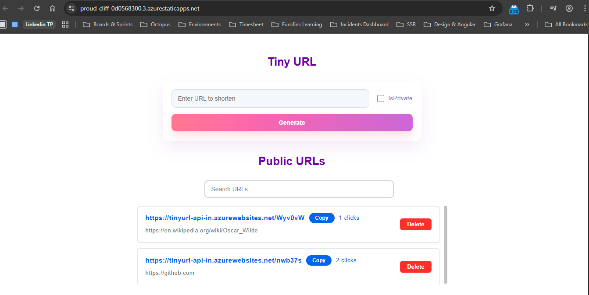
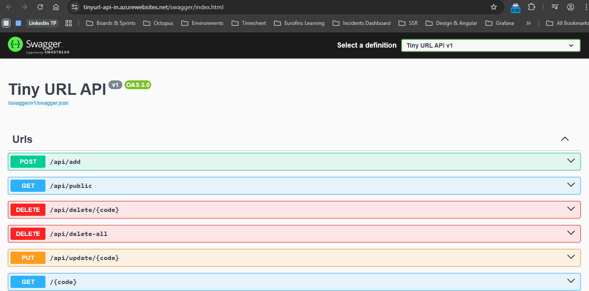

# TinyURL - Full Stack Web Application

A complete URL shortening service built with Angular, ASP.NET Core, Azure SQL Database, Azure Functions, and deployed on Azure with full CI/CD automation.

## 🚀 Live Demo

- **Frontend (Angular):** https://proud-cliff-0d0568300.3.azurestaticapps.net/
- **Backend API (Swagger):** https://tinyurl-api-in.azurewebsites.net/swagger/index.html

## 📸 Screenshots

### Frontend UI - URL Shortening & Management

*User interface for creating, searching, and managing shortened URLs with click tracking*

### API Documentation (Swagger)

*Interactive Swagger UI displaying OpenAPI 3.0 specification for all RESTful endpoints*

## ✨ Features

### Core Functionality
- ✅ **URL Shortening** - Generate short URLs from long URLs
- ✅ **Public/Private URLs** - Toggle URL visibility
- ✅ **Click Tracking** - Monitor URL usage with click counts
- ✅ **Search & Filter** - Find URLs by keyword
- ✅ **Copy to Clipboard** - One-click URL copying
- ✅ **URL Management** - Delete individual or all URLs

### Technical Features
- ✅ **Azure Functions** - Scheduled cleanup of unused URLs
- ✅ **Application Logging** - File system logging in Azure App Service
- ✅ **CORS Support** - Cross-origin resource sharing configured
- ✅ **Database Resilience** - Auto-retry logic for database connections
- ✅ **Infrastructure as Code** - Complete Terraform configuration
- ✅ **CI/CD Pipeline** - Automated GitHub Actions deployment
- ✅ **API Documentation** - Swagger/OpenAPI integration

## 🏗️ Architecture

### Technology Stack

**Frontend:**
- Angular 18.2 (Standalone Components)
- TypeScript
- SCSS (Custom styling)
- Reactive Forms (FormBuilder)
- HttpClient (API communication)
- FormsModule (Search functionality)

**Backend:**
- ASP.NET Core 9.0 (Minimal APIs)
- Entity Framework Core 9.0.11
- SQL Server / Azure SQL Database
- Swagger/Swashbuckle 10.0.1
- LINQ queries for data access

**Cloud Infrastructure:**
- Azure App Service (Linux, .NET 9)
- Azure Static Web Apps (Angular)
- Azure SQL Database
- Azure Blob Storage
- Azure Functions (Timer Trigger)
- Application Insights (Provisioned, not integrated)

**DevOps:**
- Terraform (Infrastructure as Code)
- GitHub Actions (CI/CD)
- Azure CLI

### Project Structure

```
tinyurl-webapp/
├── frontend/tinyurl/          # Angular application
│   ├── src/app/
│   │   ├── components/        # URL form & list components
│   │   │   ├── url-form/      # Create short URLs
│   │   │   └── url-list/      # Display & manage URLs
│   │   ├── services/          # API service layer
│   │   └── app.component.*    # Root component
│   └── package.json
│
├── backend/tinyurl/           # ASP.NET Core API
│   ├── Data/                  # DbContext
│   │   └── AppDbContext.cs
│   ├── Models/                # Entity models
│   │   └── ShortUrl.cs
│   ├── Migrations/            # EF Core migrations
│   ├── Program.cs             # API endpoints & configuration
│   └── tinyurl.csproj
│
├── backend/functions/         # Azure Functions
│   ├── Data/                  # DbContext (shared)
│   ├── Models/                # Entity models (shared)
│   ├── CleanupUnusedUrls.cs   # Timer trigger function
│   ├── HealthCheck.cs         # Health check function
│   ├── Program.cs
│   └── TinyUrlCleanup.csproj
│
├── infra/                     # Terraform IaC
│   ├── main.tf                # Resource definitions
│   ├── providers.tf           # Azure provider configuration
│   ├── variables.tf           # Configuration variables
│   ├── outputs.tf             # Output values
│   └── README.md              # Infrastructure docs
│
└── .github/workflows/                                   # CI/CD pipelines
    ├── main_tinyurl-api-in.yml                      # Backend API deployment
    ├── main_tinyurl-cleanup-fn.yml                  # Azure Functions deployment
    └── azure-static-web-apps-proud-cliff-0d0568300.yml  # Frontend deployment
```

## 🔧 API Endpoints

| Method | Endpoint | Description |
|--------|----------|-------------|
| `POST` | `/api/add` | Create a new short URL |
| `GET` | `/api/public` | Get all public URLs |
| `GET` | `/{code}` | Redirect to original URL (tracks clicks) |
| `DELETE` | `/api/delete/{code}` | Delete a specific URL (requires auth) |
| `DELETE` | `/api/delete-all` | Delete all URLs |
| `PUT` | `/api/update/{code}` | Reset click count |

### Sample Request/Response

**Create Short URL:**
```http
POST /api/add
Content-Type: application/json

{
  "originalURL": "https://github.com/GuhankarthickC",
  "isPrivate": false
}
```

**Response:**
```json
{
  "shortUrl": "https://tinyurl-api-in.azurewebsites.net/nwb37s"
}
```

## 🚀 Getting Started

### Prerequisites

- **Node.js** 18+ and npm
- **.NET SDK** 9.0
- **Azure CLI** (for deployment)
- **Terraform** (for infrastructure)
- **SQL Server** (local) or **Azure SQL** (cloud)

### Local Development

#### 1. Backend Setup

```powershell
cd backend/tinyurl

# Restore packages
dotnet restore

# Update connection string in appsettings.json
# "Server=localhost;Database=TinyUrlDb;Trusted_Connection=True;TrustServerCertificate=True;"

# Apply EF Core migrations
dotnet ef database update

# Run the API
dotnet run
# API runs at http://localhost:5122
# Swagger UI at http://localhost:5122/swagger
```

#### 2. Frontend Setup

```powershell
cd frontend/tinyurl

# Install dependencies
npm install

# Update API URL in src/environments/environment.ts
# apiUrl: 'http://localhost:5122/api'

# Run the app
ng serve
# App runs at http://localhost:4200
```

#### 3. Azure Functions (Optional)

```powershell
cd backend/functions

# Restore packages
dotnet restore

# Update connection string in local.settings.json

# Run locally
func start
```

## ☁️ Deployment

### Infrastructure Provisioning (Terraform)

```powershell
cd infra

# Copy example variables
Copy-Item terraform.tfvars.example terraform.tfvars

# Edit terraform.tfvars with your Azure subscription ID and passwords

# Initialize Terraform
terraform init

# Preview changes
terraform plan

# Apply infrastructure
terraform apply
```

**Resources Created:**
- Resource Group
- Azure SQL Server & Database
- App Service Plan (Linux)
- Web App (Backend API)
- Storage Account
- Function App
- Static Web App (Frontend)
- Application Insights

### CI/CD Pipeline

**Backend API Deployment:**

GitHub Actions automatically deploys the backend when changes are pushed to `main`:

```yaml
Trigger: Push to backend/tinyurl/** on main branch
Steps:
  1. Checkout code
  2. Setup .NET 9
  3. Build backend
  4. Publish artifacts
  5. Deploy to Azure App Service (Linux)
```

**Azure Functions Deployment:**

Automated deployment for the cleanup function:

```yaml
Workflow: main_tinyurl-cleanup-fn.yml
Trigger: Push to backend/functions/** on main branch
```

**Frontend Deployment:**

Static Web App deployment via GitHub Actions:

```yaml
Workflow: azure-static-web-apps-proud-cliff-0d0568300.yml
Trigger: Push to frontend/tinyurl/** on main branch
```

**Manual deployment trigger:** Go to Actions tab → Select workflow → Run workflow

## 🔐 Configuration

### Backend (`appsettings.json`)

```json
{
  "ConnectionStrings": {
    "DefaultConnection": "Server=tcp:tinyurl-sqlserver.database.windows.net,1433;Database=TinyUrlDb;User ID=sqladmin;Password=***"
  },
  "AppSettings": {
    "BaseUrl": "https://tinyurl-api-in.azurewebsites.net"
  }
}
```

### Frontend (`environment.ts`)

```typescript
export const environment = {
  production: true,
  apiUrl: 'https://tinyurl-api-in.azurewebsites.net/api'
};
```

## 📊 Database Schema

**ShortUrls Table:**

| Column | Type | Description |
|--------|------|-------------|
| `Id` | uniqueidentifier | Primary key |
| `ShortCode` | nvarchar(max) | Generated short code |
| `OriginalUrl` | nvarchar(max) | Original long URL |
| `Clicks` | int | Click count |
| `IsPrivate` | bit | Visibility flag |
| `CreatedAt` | datetime2 | Timestamp |

## 🔧 Azure Functions

**CleanupUnusedUrls** - Timer Trigger (Runs every hour at minute 0)

Automatically deletes URLs with 0 clicks that are older than 24 hours. The function runs on schedule `0 0 * * *` using a cron expression to clean up unused URLs and maintain database efficiency.

## 📝 Logging

Application logs are stored in Azure App Service:
- **File System Logging:** 7-day retention, 35 MB quota
- **Location:** `/home/LogFiles/Application/`
- **Access:** Azure Portal → Log Stream or Azure CLI

```powershell
# View logs
az webapp log tail --name tinyurl-api-in --resource-group tinyurl-rg
```

## 💰 Cost Estimate

**Current Setup (Free Tier):**

| Resource | SKU | Monthly Cost |
|----------|-----|--------------|
| App Service (Backend) | F1 (Free) | $0 |
| SQL Database | Basic | ~$5 |
| Function App | Consumption | ~$0 |
| Storage Account | Standard LRS | ~$0.50 |
| Static Web App | Free | $0 |
| Application Insights | Free (5GB) | $0 |
| **Total** | | **~$5-6 USD/month** |

**Production-Ready Estimate (Paid Tier):**

| Resource | SKU | Monthly Cost |
|----------|-----|--------------|
| App Service (Backend) | B1 | ~$13 |
| SQL Database | Basic | ~$5 |
| Function App | Consumption | ~$0-2 |
| Storage Account | Standard LRS | ~$0.50 |
| Static Web App | Free | $0 |
| Application Insights | Free (5GB) | $0 |
| **Total** | | **~$18-20 USD/month** |

*Note: Using F1 (Free) tier for App Service for development. Upgrade to B1 for production workloads.*

## 🛠️ Development Tools

- **VS Code** - Code editor
- **Postman** - API testing
- **Azure Portal** - Cloud resource management
- **Git** - Version control

## 📚 Key Learnings & Best Practices

- ✅ **Minimal APIs** - Modern ASP.NET Core approach
- ✅ **Standalone Components** - Angular latest patterns
- ✅ **Infrastructure as Code** - Terraform for reproducible deployments
- ✅ **CI/CD Automation** - GitHub Actions for seamless delivery
- ✅ **Database Resilience** - Retry logic for cloud databases
- ✅ **CORS Configuration** - Secure cross-origin requests
- ✅ **Environment Variables** - Separate dev/prod configurations
- ✅ **File System Logging** - Azure App Service log retention

## 🤝 Contributing

This is a learning project, but suggestions are welcome!

## 📄 License

This project is created for educational purposes.

## 👤 Author

**Guhan Karthick C**
- GitHub: [@GuhankarthickC](https://github.com/GuhankarthickC)

---

**Built with ❤️ using Angular, ASP.NET Core, and Azure**
